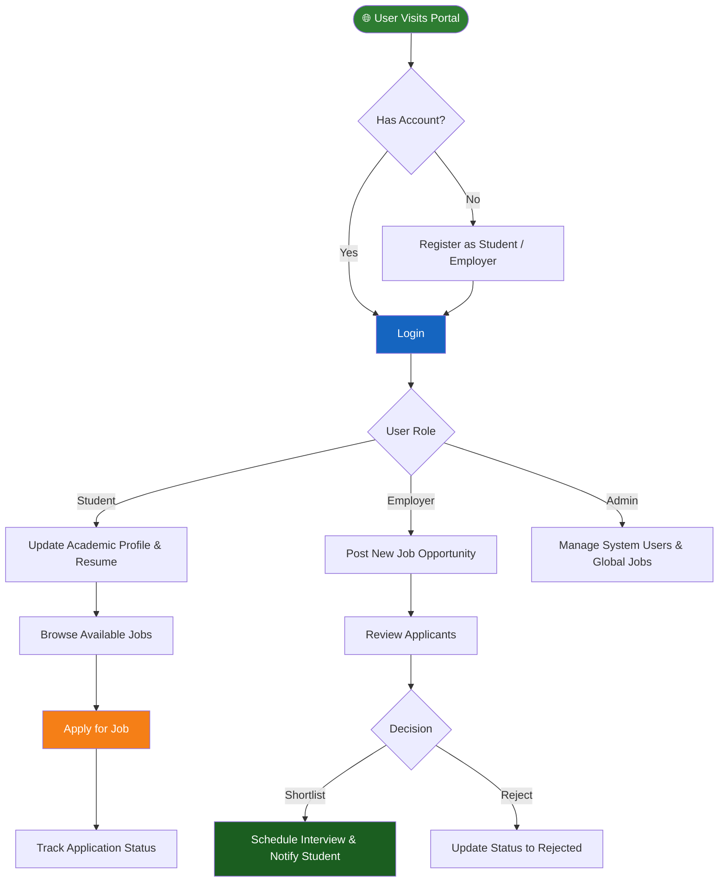

<div align="center">

# 🎓 Campus Recruitment Portal

### *AI-Enhanced Full-Stack Web Application for Streamlined College Placements*

[](https://www.java.com/)
[](https://spring.io/projects/spring-boot)
[](https://www.thymeleaf.org/)
[](https://www.mysql.com/)
[](https://campusrecuriment-production.up.railway.app/auth/login?logout=true)
[](LICENSE)
[](CONTRIBUTING.md)

> 🚀 **A comprehensive, real-world recruitment solution** designed to digitalize and streamline the placement process within educational institutions. By providing a centralized platform for Students, Employers, and Administrators, the system bridges the gap between academic talent and industry opportunities.

</div>

---

## 📋 Table of Contents

- [📌 Problem Statement](#-problem-statement)
- [💡 Solution & Approach](#-solution--approach)
- [🎯 Objectives](#-objectives)
- [🛠️ Technology Stack](#️-technology-stack)
- [📁 Project Structure](#-project-structure)
- [🔬 How It Works — System Flowchart](#-how-it-works--system-flowchart)
- [💻 Code Analysis](#-code-analysis)
- [📦 Dependencies](#-dependencies)
- [🚀 Installation & Setup](#-installation--setup)
- [🎬 System Demo](#-system-demo)
- [🌍 Impact & Real-World Significance](#-impact--real-world-significance)
- [🔮 Future Enhancements](#-future-enhancements)
- [🤝 Open Source Contribution](#-open-source-contribution)
- [📄 License](#-license)
- [👨‍💻 Author & Acknowledgments](#-author--acknowledgments)

---

## 📌 Problem Statement

> **"Traditional campus recruitment processes rely heavily on manual coordination and fragmented communication channels — this portal solves it by centralizing everything."**

### Background

Educational institutions traditionally handle placements using physical notice boards, scattered email threads, and manual resume submissions. This archaic approach leads to:
- Lost opportunities for eligible students
- High administrative overhead for placement officers
- Difficulties for visiting companies in managing and tracking applicants

### The Core Problem

| Challenge | Description |
|-----------|-------------|
| 🔴 **Fragmented Communication** | Students miss important job postings due to unorganized announcements |
| 🔴 **Manual Resume Handling** | Physical or scattered digital resume submissions are hard to track and sort |
| 🔴 **Lack of Transparency** | Students have no real-time tracking of their application statuses |
| 🔴 **Inefficient Employer Tools** | Employers struggle to filter candidates and schedule interviews seamlessly |
| 🔴 **Administrative Bottlenecks** | Placement cells spend excessive time on manual data entry |

---

## 💡 Solution & Approach

### Our Strategy

We digitized the entire campus recruitment lifecycle into a secure, role-based web portal:

1. **Role-Based Portals → Students, Employers, Admins** — Custom dashboards and permissions for each user type.
2. **Automated Job Matching → Eligibility Filters** — Job postings are smartly displayed to students who meet the academic criteria.
3. **Seamless Document Management → Cloud Resumes** — Secure resume uploads and downloads using `MultipartFile`.
4. **Real-Time Tracking → Application Status** — Live updates from "Applied" to "Shortlisted" or "Rejected".
5. **Mobile Accessibility → Android Wrapper** — A dedicated `.apk` allowing users to access the platform natively on Android.
6. **Automated Notifications → Email Service** — Push notifications for critical events like interview scheduling.

### Architecture Overview

```text
[Students / Employers]
        ↓  HTTP / HTTPS Requests
[Frontend Views (Thymeleaf, HTML5, CSS3, JS)]
        ↓  REST API Calls & Form Submissions
[Spring Security Layer (Authentication & Authorization)]
        ↓
[Controllers (@RestController / @Controller)]
        ↓  Service Layer (Business Logic & Validation)
[Spring Data JPA (Repositories)]
        ↓  JDBC / Hibernate
[MySQL / H2 Database]
```

---

## 🎯 Objectives

- ✅ **Digitalize student profiles** encompassing academic details and technical skills
- ✅ **Provide a dedicated employer dashboard** to post jobs, view applicants, and shortlist candidates
- ✅ **Enable secure resume management** with upload/download functionalities
- ✅ **Implement role-based access control (RBAC)** to secure sensitive student and company data
- ✅ **Deploy a production-ready application** using Railway for global access
- ✅ **Provide a mobile companion app** using a WebView `.apk` for Android users
- ✅ **Make the solution open-source** to foster community improvements and feature additions

---

## 🛠️ Technology Stack

### Backend & Database

| Component | Specification | Role |
|-----------|--------------|------|
| **Framework** | Spring Boot 3.2.5 | Core application framework |
| **Language** | Java 17 | Primary programming language |
| **Security** | Spring Security 6 | Authentication, Authorization, Password Hashing |
| **ORM** | Spring Data JPA / Hibernate | Object-relational mapping |
| **Database** | MySQL (Production) / H2 (Test) | Persistent data storage |
| **Validation** | Hibernate Validator | Backend input constraints |
| **Email** | Spring Boot Mail | Notification dispatch |

### Frontend & Deployment

| Technology | Version | Purpose |
|--------------------|---------|---------|
| **Thymeleaf** | 3.x | Server-side Java template engine |
| **HTML5/CSS3** | — | Structure and responsive styling |
| **JavaScript/ES6** | — | Dynamic table filtering and client-side logic |
| **Railway** | PaaS | Production cloud hosting |
| **Android APK** | — | Native mobile WebView application |

---

## 📦 Dependencies

### Core Maven Dependencies

Defined in `pom.xml`:

```xml
spring-boot-starter-data-jpa       // Database operations
spring-boot-starter-security       // RBAC and Authentication
spring-boot-starter-thymeleaf      // View rendering
spring-boot-starter-web            // REST APIs and MVC
spring-boot-starter-validation     // Input validation
spring-boot-starter-mail           // Email notifications
mysql-connector-j                  // MySQL Database Driver
lombok                             // Boilerplate code reduction
```

---

## 📁 Project Structure

```text
Campus-Recruitment-Portal/
│
├── 📁 android-apk/                     # Mobile Application Wrapper
│
├── 📁 src/main/java/com/campus/recruitment/portal/
│   ├── 📁 config/                      # Security & App Configurations
│   ├── 📁 controller/                  # Web and API Controllers (Admin, Auth, Employer, Student)
│   ├── 📁 model/                       # JPA Entities (User, Job, Interview, Application, etc.)
│   ├── 📁 repository/                  # Spring Data JPA Interfaces
│   ├── 📁 security/                    # Custom Security Details Services
│   ├── 📁 service/                     # Business Logic Layer
│   └── 📄 PortalApplication.java       # ⭐ Spring Boot Entry Point
│
├── 📁 src/main/resources/
│   ├── 📁 templates/                   # Thymeleaf HTML Views
│   │   ├── 📁 admin/                   # Admin pages
│   │   ├── 📁 auth/                    # Login/Register pages
│   │   ├── 📁 employer/                # Employer dashboards
│   │   └── 📁 student/                 # Student dashboards & application tracking
│   └── 📄 application.properties       # Database & Server settings
│
├── 📄 pom.xml                          # Maven build and dependencies
├── 📄 START_BACKEND.bat                # Utility script for local execution
└── 📄 README.md                        # Documentation
```

---

## 🔬 How It Works — System Flowchart



### Step-by-Step Operation

| Step | Action | Description |
|------|--------|-------------|
| 1 | **Authentication** | Users register and log in securely. Role determines the dashboard view. |
| 2 | **Profile Setup** | Students input CGPA, skills, and upload resumes. Employers detail company info. |
| 3 | **Job Posting** | Employers create job listings defining required skills and salary packages. |
| 4 | **Application Phase** | Students filter jobs and submit applications directly through the portal. |
| 5 | **Review & Action** | Employers view a centralized list of applicants, downloading resumes for review. |
| 6 | **Status Update** | Employer marks a student as Shortlisted or Rejected, triggering real-time updates. |

---

## 💻 Code Analysis

### Main Architecture Decisions

#### Security Logic (`SecurityConfig.java`)

```java
// Role-based access control ensuring absolute data privacy
http.authorizeHttpRequests(auth -> auth
    .requestMatchers("/student/**").hasRole("STUDENT")
    .requestMatchers("/employer/**").hasRole("EMPLOYER")
    .requestMatchers("/admin/**").hasRole("ADMIN")
    .anyRequest().authenticated()
)
```

#### Entity Relationships (`Job.java` & `Application.java`)

```java
// A Job can have many Applications (One-to-Many)
@OneToMany(mappedBy = "job", cascade = CascadeType.ALL)
private List<Application> applications;

// An Application belongs to one Student and one Job (Many-to-One)
@ManyToOne
@JoinColumn(name = "student_id")
private User student;
```

### Design Decisions

| Decision | Rationale |
|----------|-----------|
| **Spring Boot & JPA** | Rapid development, robust ecosystem, and elimination of boilerplate SQL. |
| **Thymeleaf Templating** | Seamless integration with Spring Security tags directly in the HTML. |
| **Server-Side Rendering** | Ensures fast initial load times and high security for sensitive placement data. |
| **Global Exception Handler** | Centralized `@ControllerAdvice` provides uniform, user-friendly error messages. |

---

## 🚀 Installation & Setup

### Prerequisites

- [Java Development Kit (JDK)](https://www.oracle.com/java/technologies/javase/jdk17-archive-downloads.html) (17 or higher)
- Maven
- MySQL Server (or use H2 in-memory DB for quick testing)
- IDE of your choice (VS Code, IntelliJ IDEA, Eclipse)

### 1. Clone the Repository

```bash
git clone https://github.com/your-username/campus-recruitment-portal.git
cd campus-recruitment-portal
```

### 2. Configure Database

Open `src/main/resources/application.properties` and update the credentials:

```properties
spring.datasource.url=jdbc:mysql://localhost:3306/campus_recruitment
spring.datasource.username=root
spring.datasource.password=your_password
spring.jpa.hibernate.ddl-auto=update
```

### 3. Run the Application

You can run the application using the provided batch script:

```bash
./START_BACKEND.bat
```

Or via Maven:

```bash
mvn spring-boot:run
```

### 4. Access the Portal

Open your browser and navigate to: `http://localhost:8080`

---

## 🌍 Impact & Real-World Significance

### Who Benefits

| Stakeholder | Benefit |
|-------------|---------|
| 🎓 **Students** | Direct access to companies, transparent tracking, easy resume management |
| 🏢 **Employers** | Centralized applicant pool, quick filtering, automated interview scheduling |
| 🏫 **Placement Officers** | Minimal manual paperwork, automated data handling, holistic tracking |
| 📱 **Mobile Users** | On-the-go access via the provided Android `.apk` application |

### System vs. Traditional Approach

| Traditional Placement Process | Smart Recruitment Portal |
|---------------------|---------------------|
| Physical resume drops | **1-Click Digital Apply** |
| Delayed communication | **Real-time Status Dashboard** |
| Difficult tracking for employers | **Centralized Applicant Manager** |
| Vulnerable physical data | **Secure, Encrypted Cloud Storage** |

---

## 🎬 System Demo

### Live Production Deployment

Experience the fully functional live deployment hosted on Railway:
👉 **[Launch Campus Recruitment Portal](https://campusrecuriment-production.up.railway.app/auth/login?logout=true)**

### Android Application

For mobile users, navigate to the `android-apk/app/release/` directory in this repository to download and install the companion mobile application.

---

## 🔮 Future Enhancements

- [ ] **AI Resume Parsing** — Automatically extract skills from uploaded PDFs.
- [ ] **Video Interview Rooms** — Embed WebRTC for direct remote interviews.
- [ ] **Advanced Analytics Dashboard** — Visual charts for placement statistics.
- [ ] **In-App Messaging** — Direct chat between employers and shortlisted students.
- [ ] **Alumni Network Integration** — Allow alumni to post referral jobs.

---

## 🤝 Open Source Contribution

We warmly welcome contributions from the community! Whether it's **UI improvements**, **new features**, **documentation**, or **bug fixes** — every contribution matters! 🎉

### How to Contribute

```bash
# 1. Fork the repository on GitHub

# 2. Clone your fork
git clone https://github.com/YOUR_USERNAME/campus-recruitment-portal.git

# 3. Create a feature branch
git checkout -b feature/your-feature-name

# 4. Make your changes and commit
git commit -m "feat: add AI resume parsing"

# 5. Push to your fork
git push origin feature/your-feature-name

# 6. Open a Pull Request → main branch on GitHub
```

### Contribution Areas

| Area | Good First Issue? | Description |
|------|------------------|-------------|
| 🐛 **Bug Fixes** | ✅ Yes | Fix edge cases in UI responsiveness or validation |
| ➕ **UI Enhancements** | ✅ Yes | Improve Thymeleaf templates and CSS styling |
| 📧 **Email Integration** | ⚡ Medium | Enhance HTML email templates for notifications |
| 📱 **React/Vue Frontend** | 🔥 Advanced | Decouple Thymeleaf and build a standalone frontend |
| 🤖 **AI Features** | 🔥 Advanced | Integrate Python/AI endpoints for intelligent job matching |

### Coding Standards

- Follow standard Java naming conventions and clean code principles.
- Use meaningful variable names and document complex logic.
- Write meaningful commit messages using [Conventional Commits](https://www.conventionalcommits.org/).

### Reporting Issues

Please use GitHub Issues to:
- 🐛 Report bugs
- 💡 Request features
- ❓ Ask questions

---

## 📄 License

This project is licensed under the **MIT License** — completely free to use, modify, and distribute.

```text
📄 License
This project is licensed under the Apache License 2.0 — you are free to use, modify, and distribute this code with proper attribution and compliance with the license terms.

Apache License
Version 2.0, January 2004
http://www.apache.org/licenses/

Copyright (c) 2026 Arokiya Nithish J

Licensed under the Apache License, Version 2.0 (the "License");
you may not use this file except in compliance with the License.
You may obtain a copy of the License at

```
http://www.apache.org/licenses/LICENSE-2.0  
```

Unless required by applicable law or agreed to in writing, software
distributed under the License is distributed on an "AS IS" BASIS,
WITHOUT WARRANTIES OR CONDITIONS OF ANY KIND, either express or implied.
See the License for the specific language governing permissions and
limitations under the License.

```

See [LICENSE](LICENSE) for full details.

---

## 👨‍💻 Author & Acknowledgments

### Author

**Arokiya Nithish J**
- Role: Full Stack Java Developer
- 📅 Year: 2026
- 🎓 Engineering Student (B.Tech AI&DS)
- 💼 Domain: Java | Spring Boot | Web Development

**Contacts**
- GitHub: [@ArokiyaNithish](https://github.com/ArokiyaNithish)
- LinkedIn: [@Arokiya Nithish J](https://www.linkedin.com/in/arokiya-nithishj/)
- Email: arokiyanithishj@gmail.com
- Portfolio: [arokiyanithish.github.io/portfolio](https://arokiyanithish.github.io/portfolio/)

### Acknowledgments

- 🏫 **Educational Institutions** — For providing the real-world use case.
- 🍃 **Spring Ecosystem** — For the robust frameworks powering the backend.
- 🚉 **Railway.app** — For seamless production deployment.

---

<div align="center">

For support, email arokiyanithishj@gmail.com or open an issue on GitHub.

### 🌟 If this project helped you — please give it a ⭐ Star on GitHub!

**#Java #SpringBoot #Recruitment #WebDevelopment #OpenSource**

*Made with ❤️ by Arokiya Nithish*

*© 2026 — Arokiya Nithish J*

</div>


```
NOTICE

Project Name: Campus Recruitment Portal
Copyright (c) 2026 Arokiya Nithish J

This product includes software developed by Arokiya Nithish J.

Licensed under the Apache License, Version 2.0 (the "License");
you may not use this file except in compliance with the License.
You may obtain a copy of the License at:

    http://www.apache.org/licenses/LICENSE-2.0

Unless required by applicable law or agreed to in writing, software
distributed under the License is distributed on an "AS IS" BASIS,
WITHOUT WARRANTIES OR CONDITIONS OF ANY KIND, either express or implied.
See the License for the specific language governing permissions and
limitations under the License.

---

Third-Party Attributions

This project may include or depend on third-party libraries.
Attributions and licenses for those components are listed below:

* Spring Boot — Copyright (c) 2012-2026 Pivotal, Inc. / VMware, Inc.
  Licensed under Apache License 2.0
  Source: https://github.com/spring-projects/spring-boot

* Spring Security — Copyright (c) 2004-2026 Acegi Technology Pty Limited
  Licensed under Apache License 2.0
  Source: https://github.com/spring-projects/spring-security

* Hibernate ORM — Copyright (c) 2006-2026 Red Hat, Inc.
  Licensed under GNU Lesser General Public License v2.1
  Source: https://github.com/hibernate/hibernate-orm

* MySQL Connector/J — Copyright (c) 2020-2026 Oracle Corporation
  Licensed under GNU General Public License v2.0 with FOSS Exception
  Source: https://github.com/mysql/mysql-connector-j

* Thymeleaf — Copyright (c) 2011-2026 The Thymeleaf Team
  Licensed under Apache License 2.0
  Source: https://github.com/thymeleaf/thymeleaf

* Lombok — Copyright (c) 2009-2026 The Project Lombok Authors
  Licensed under MIT License
  Source: https://github.com/projectlombok/lombok

---

Modifications

If you have modified this project, you should add a statement here such as:

"This project has been modified by <Your Name/Organization> on <Date>.
Changes include: <brief description of changes>"

---

END OF NOTICE
```
